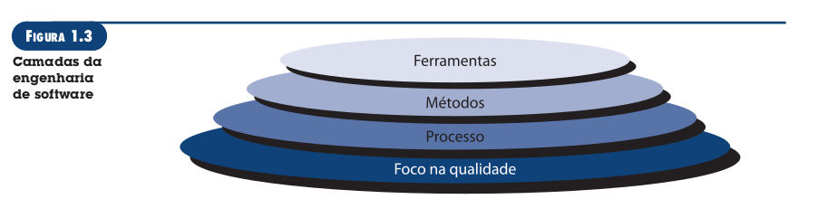

## Engenharia de Software

Prof: Humberto Marques

----

## Fatos reais
- Entender o problema procede o desenvolvimento de qualquer solução
- Software não complica a vida das pessoas. Pelo contrário, é solução
- Projetar é uma atividade fundamental. Todo desenvolvedor é um projetista
- A qualidade é fundamental
- Um software deve ser fácil manutenção (exige uma maior projeção)

## Definições

"Engenharia de software é o estabelecimento e o emprego de sólido princípios de engenharia de modo a obter software de maneira econômica, que seja confiável e funcione de forma eficiente em máquinas reais."

"Engenharia de software: (1) A aplicação de uma abordagem sistemática, disciplinada e quantificável no desenvolvimento, na operação e na manutenção de software; isto é, a aplicação de engenharia ao software. (2) O estudo de abordagens como definido em (1)."

## Tecnologia em camadas

Qualquer abordagem de engenharia (inclusive engenharia de software) deve estar fundamentada em um comprometimento organizacional com a qualidade.Portanto, **a pedra fundamental** que sustenta a engenharia de software **é o foco na qualidade**.

A base para a engenharia de software é a camada de processos. O **processo de engenharia de software** é a liga que mantém as camadas de tecnologia coesas e **possibilita o desenvolvimento de software de forma racional e dentro do prazo**. O processo **define uma metodologia** que deve ser estabelecida para a entrega efetiva de tecnologia de engenharia de software. Falar de processo é falar de gerenciamento do projeto com o objetivo aumentar a qualidade do software com o menor custo possível.

Os **métodos da engenharia de software** baseiam-se em um conjunto de princípios básicos que governam cada área da tecnologia e **inclui atividades de modelagem** e outras técnicas descritivas. Há métodos para todas as fases de um processo genérico que são: comunicação, análise de requisitos, modelagem de projeto, construção de programa, testes e suporte.

As **ferramentas da engenharia de software** fornecem suporte automatizado ou semi-automatizado para o processo e para os métodos. Quando as ferramentas são integradas, de modo que as informações criadas por uma ferramenta possam ser usadas por outra, é estabelecido **um sistema para o suporte ao desenvolvimento de software**.

## Questões dessa engenharia
- Qual problema tem que ser resolvido? (Encontrar os requisitos)
- Quais características do software são utilizadas para resolver o problema?
- Como o software será construído? (Processos e métodos)
- Como os erros serão identificados? (Testes)
- Como o software será mantido? (Manutenção)

## A prática da Engenharia de Software

Princípios importantes que que embora antigos são válidos até hoje que foram retirados do livro "**How to Solve it**"

### Compreendendo o problema
- Quem tem interesse na solução do problema?
- Quais são as incógnitas?
- O problema pode ser dividído?
- O problema pode ser representado gráficamente? 

### Planejando a solução
- Você já viu problema similares?
- Algum problema similar já foi resolvido?
- É possível definir subproblemas?
- É possível representar uma solução de maneira que conduza a uma implementação efetiva?

### Execute/leve adiante o plano
- A solução se adéqua ao plano?
- Cada uma das partes componentes da solução esta provavelmente correta?

### Examine o resultado
- É possível testar cada parte componente da solução?
- A solução produz resultados que adéquam aos dados, ás funções e características necessárias?