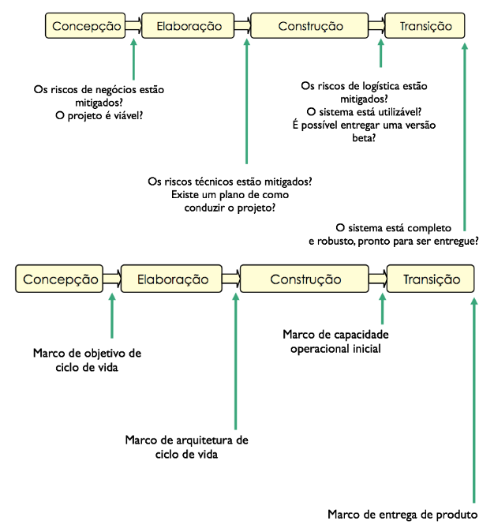

# Projeto de Software no RUP

Princípios essenciais do RUP (Rational Unified Process)

- **Atacar os riscos principais de forma rápida e contínua**
- Garantir que se está provendo algo de valor ao cliente
- **Concentrar-se em produzir software executável**
- **Acomodar mudanças no projeto**
- **Definir a arquitetura o mais cedo possível**
- **Construir o sistema com componentes**
- Trabalhar em equipe
- Fazer da qualidade uma forma de vida

Estão destacados acima as pautas cruciais para a disciplina de projeto de software.

## Atacar os riscos

O RUP prega que devemos atacar primeiro os problemas que apresentam o maior risco para o sucesso do projeto. Em cada iteração deve-se listar os principais riscos e agir de forma a mitigá-los

## Definir a arquitetura o mais cedo possível

A arquitetura é a descrição dos componentes principais do sistema e de suas interfaces. No início do projeto, deve-se projetar, implementar e testar a arquitetura através do desenvolvimento de protótipos arquiteturais. As vantagens desta abordagem são:

- Permitir refinar as estimativas de esforço
- Permitir que os membros da equipe se familiarizem com as tecnologias utilizadas
- Atacar alguns dos principais riscos

## Construir o sistema com componentes

Componentes separam a interface da implementação seguindo os princípios de encapsulamento e ocultação de informações. Componentes possibilitam a reutilização de partes e reduzem o impacto de mudanças

## Desenvolvimento iterativo

O RUP abandona o modelo de “cascata”, em que cada etapa de desenvolvimento deve ser concluída antes do início da próxima. O modelo iterativo prega que um sistema deve ser desenvolvido em uma sequência de passos incrementais. Cada iteração envolve diversas atividades de desenvolvimento desde requisitos até testes. O RUP já foi abordado e estudado na matéria de processo de software

## Dimensões do RUP

O RUP possui duas dimensões para organização das atividade: as fases e as disciplinas.

## Marcos principais entre as fases do RUP

As duas fases do processo RUP que estão interligadas com a discipĺina de projeto são a **concepção e elaboração**.

## Concepção

### Quanto as iterações

É comum ter apenas uma iteração na fase de concepção. Quando há mais de uma iteração:

- A primeira deve se concentrar em O QUE construir
- As outras devem se concentrar em COMO construir

### Objetivos

**O QUE** construir:

- Compreender o que dever ser construído
- Identificar as funcionalidades-chave do sistema
- Determinar ao menos uma solução possível

**COMO** construir:

- Compreender os custos, prazos e riscos envolvidos
- Decidir que processo seguir
- Decidir que ferramentas utilizar

## Elaboração

### Quanto as Iterações

A fase de elaboração pode ter uma ou mais iterações. 

Na primeira iteração deve-se:

- Projetar, implementar e testar alguns cenários críticos
- Identificar, implementar e testar um conjunto inicial de mecanismos arquiteturais
- Fazer o projeto lógico inicial do banco de dados
- Detalhar os fluxos dos casos de uso de maior prioridade
- Validar a arquitetura, tendo em vista os riscos arquiteturais, por exemplo, o desempenho é adequado?

Na segunda iteração deve-se:

- Consertar os problemas encontrados na primeira iteração 
- Projetar, implementar e testar o restante dos cenários arquiteturalmente relevantes
- Implementar aspectos de concorrência e distribuição, se necessário
- Identificar, implementar e testar os mecanismos arquiteturais restantes
- Terminar o projeto do banco de dados e implementar uma versão inicial
- Detalhar os fluxos dos casos de uso que não foram detalhados na primeira iteração
- Estabilizar a arquitetura através de testes e refinamentos

### Objetivo

- Completar a descrição detalhada da maioria dos casos de uso. Casos de uso muito simples podem ser detalhados na fase de construção, ou nunca detalhados
- Criar protótipo de interface para casos de uso principais para validar as funcionalidades junto aos stakeholders
- Criar um modelo de domínio, com a descrição do ambiente onde o sistema vai atuar
- Projetar, implementar e validar a arquitetura

### Marco

- A Visão e os requisitos estão estáveis
- A arquitetura é estável
- As técnicas a serem usadas para teste e avaliação foram experimentadas
- Testes e validações de protótipos executáveis demonstraram que os principais riscos técnicos foram resolvidos
- Os planos de desenvolvimento para a fase de construção estão adequados para permitir que o trabalho continue
- As estimativas de custo e esforço têm credibilidade
- Os stakeholders estão de acordo que a visão pode ser alcançada se o plano de desenvolvimento for executado, no contexto da arquitetura definida
- O índice de gastos previstos versus realizados é aceitável

### Artefatos produzidos

- Protótipo arquitetural
- Lista de riscos (atualizada)
- Adaptação do processo (atualizada)
- Ambiente de desenvolvimento
- Modelo arquitetural
- Modelo de dados
- Plano de desenvolvimento (atualizado)
- Modelo de casos de uso detalhando 80% dos casos de uso
