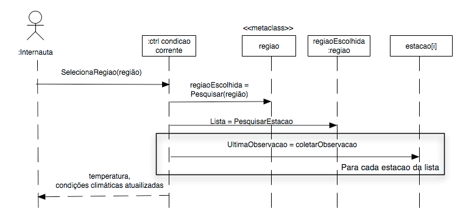

# Projeto de Interações

## Diagrama de Sequência do Sistema - DSS

Após descrever os fluxos dos casos de uso e o diagrama de classes de domínio, podemos **completar o modelo da análise** investigando os eventos de entrada e saída do sistema e ilustrando-os com diagramas de sequência da UML. Neste diagrama, o sistema é considerado como uma “caixa preta” e o comportamento do sistema **é uma descrição do que o sistema faz sem explicar como ele faz**.

Casos de uso descrevem como os atores externos interagem com o sistema de software que estamos interessados em criar. O ator gera eventos reconhecidos pelo sistema solicitando alguma operação como resposta. Por exemplo, o caixa entra com o identificador de um item solicitando ao sistema registrar a compra daquele item.

Diagramas de sequência do Sistema (DSS) ilustram as interações dos atores com o sistema e as operações iniciadas por eles. É uma figura que mostra os eventos que os atores externos geram, e a ordem em que eles acontecem no tempo. Deve ser feito um diagrama de sequência de sistema (DSS) para a sequência de sucesso principal de cada caso de uso e para cenários frequentes ou alternativos.

## Identificação de eventos

Eventos são ocorrências de troca de informação entre os atores e o sistema. **O evento não é a informação trocada mas sim o fato de alguma informação ter sido trocada**. Modelamos o comportamento do sistema através de eventos e das ações executadas em respostas a eles. Os eventos em geral estão associados aos verbos na descrição textual dos casos de uso. Desta forma, para identificar eventos um bom começo é identificar os verbos e os contextos nos quais aparecem. 

Diagramas de sequência detalhados são refinados a partir do DSS, s**ubstituem o sistema pelos objetos do modelo de domínio e mostram as interações entre os objetos do sistema**.

## Conceitos iniciais

Uma **interação** é um comportamento que compreende **um conjunto de mensagens trocadas entre um conjunto de objetos em um determinado contexto para realizar uma atividade** com um propósito específico. Uma **mensagem** é a **descrição de uma comunicação entre objetos** que contém informações relacionadas ao resultado esperado da atividade. 

O diagrama abaixo apresenta a interação entre os objetos do sistema para realizar a operação SelecionaRegião retornando as condições climáticas atualizadas.  A mensagem "UltimaObservacao = coletarObservação" retorna o resultado da última observação climática na estação[i]. 

## Diagrama de Interação

O diagrama de interação é utilizado para modelar os aspectos dinâmicos de sistemas. Ele mostra uma interação, formada por um conjunto de objetos e seus relacionamentos, incluindo as mensagens que poderão ser enviadas entre eles. Eles podem aparecer sozinhos facilitando a visualização da dinâmica de uma determinada sociedade de objetos, ou eles podem modelar um determinado fluxo de controle de um caso de uso. 

Na UML os diagramas de interação podem ser de dois tipos:

- Diagrama de sequência: 
  - apresenta as mensagens ordenadas no tempo
  - a visualização fica prejudicada a medida que o número de objetos cresce 
  - disposição dos objetos em uma dimensão
- Diagrama de comunicação:  (era chamado de Diagrama de Colaboração na UML 1.x)
  - apresenta as mensagens enfatizando os relacionamentos entre os objetos
  - difícil ver a sequência de mensagens
  - melhor utilização do espaço pois os objetos estão dispostos em duas dimensões

