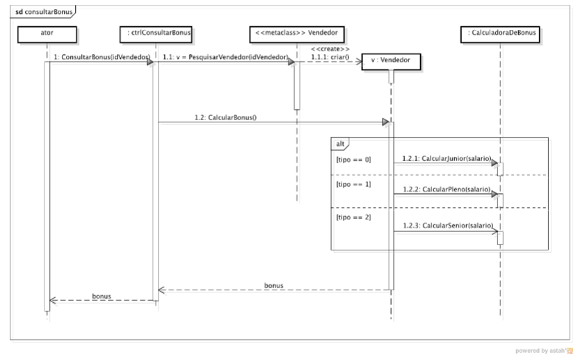
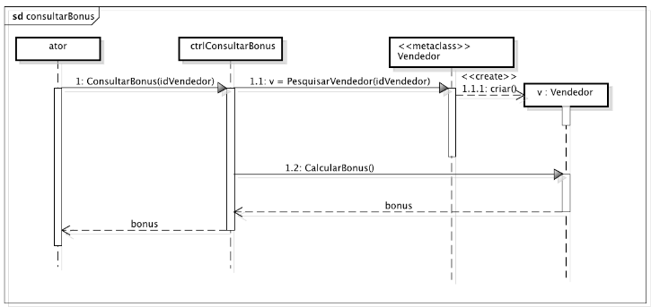

# Exercitar os conceitos de diagramas de interação e projeto de objetos com responsabilidades

Apresente sugestões de melhoria no projeto da solução. Desenhe o novo diagrama de sequência detalhado e o diagrama de classe de projeto proposto.

## Solução

Suponhamos que temos os dados dos vendedores salvos em um banco de dados e que há uma coluna chamada de TIPO_VENDEDOR que identifica o tipo do vendedor por uma numeração.

### Classes

**Vendedor**
- Atributos: id, nome, salário
- Métodos: Receber aumento, Calcular bonus
- Métodos estáticos: Buscar vendedor por id (busca no banco de dados)

**VendedorJunior**
- Herda atributos e métodos do Vendedor
- Sobrescreve o método de calcular bonus

**VendedorPleno**
- Herda atributos e métodos do Vendedor
- Sobrescreve o método de calcular bonus

**VendedorSenior**
- Herda atributos e métodos do Vendedor
- Sobrescreve o método de calcular bonus

Quanto a diagrama de sequencia, teríamos o seguinte resultado:

